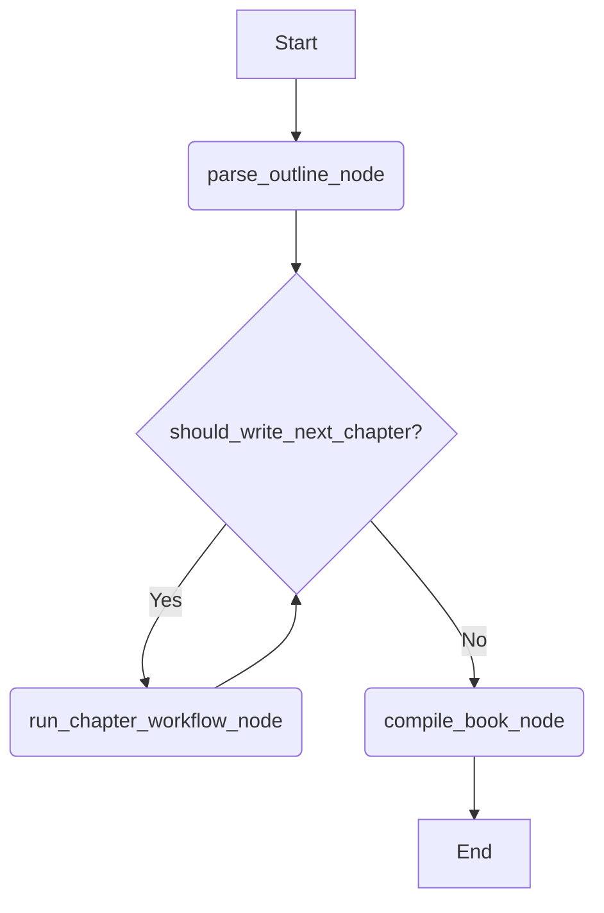

# 主工作流设计方案 (Main Workflow Design)

本文档详细描述了自动化图书撰写框架的主工作流。该工作流负责协调整个图书的撰写过程，通过按顺序调用“章节撰写”子工作流来生成每个章节，并最终将它们汇编成完整的书稿。

## 1. 工作流状态 (Workflow State)

工作流的状态管理是整个流程的核心。我们定义一个 `BookWritingState` TypedDict 来在不同节点之间传递和更新数据。

```python
from typing import TypedDict, List

class BookWritingState(TypedDict):
    """
    Represents the state of the book writing process.
    """
    # Input state
    book_outline: str  # 完整的图书大纲

    # Internal state
    chapter_outlines: List[str]  # 按顺序排列的每个章节的大纲列表
    completed_chapters: List[str]  # 已经完成的章节内容列表
    current_chapter_index: int  # 当前正在处理的章节索引

    # Output state
    final_book: str  # 最终拼接完成的书稿
```

**字段说明:**

*   `book_outline`: **[输入]** 包含整本书结构和内容的完整大纲字符串。这是工作流的初始输入。
*   `chapter_outlines`: **[中间状态]** 由 `parse_outline_node` 节点生成，将 `book_outline` 分解为一系列独立的章节大纲。
*   `completed_chapters`: **[中间状态]** 用于存储由 `run_chapter_workflow_node` 节点生成的每个已完成章节的内容。
*   `current_chapter_index`: **[中间状态]** 一个指针，用于追踪当前正在处理的章节，控制循环的进度。
*   `final_book`: **[输出]** 由 `compile_book_node` 节点生成，是所有 `completed_chapters` 内容拼接而成的最终书稿。

## 2. 工作流节点 (Workflow Nodes)

工作流由以下三个核心节点组成：

### a. `parse_outline_node`

*   **职责**: 解析完整的图书大纲，为后续的章节撰写做准备。
*   **输入**: `BookWritingState` (主要使用 `book_outline`)。
*   **处理逻辑**:
    1.  读取 `state['book_outline']`。
    2.  根据预定义的规则（例如，按特定的标题或分隔符）将大纲字符串分割成一个章节大纲列表。
    3.  初始化状态，为开始撰写过程做准备。
*   **输出/状态更新**:
    *   `state['chapter_outlines']` 更新为解析出的章节大纲列表。
    *   `state['completed_chapters']` 初始化为空列表 `[]`。
    *   `state['current_chapter_index']` 初始化为 `0`。

### b. `run_chapter_workflow_node`

*   **职责**: 调用并执行“章节撰写”子工作流来处理单个章节。这是工作流中的核心循环体。
*   **输入**: `BookWritingState` (主要使用 `chapter_outlines` 和 `current_chapter_index`)。
*   **处理逻辑**:
    1.  从 `state['chapter_outlines']` 中获取当前章节的大纲，索引为 `state['current_chapter_index']`。
    2.  调用“章节撰写”子工作流，并将当前章节的大纲作为其输入。
    3.  接收子工作流返回的已完成章节内容。
*   **输出/状态更新**:
    *   将返回的章节内容追加到 `state['completed_chapters']` 列表中。
    *   `state['current_chapter_index']` 的值加 1，为处理下一个章节做准备。

### c. `compile_book_node`

*   **职责**: 在所有章节都完成后，将它们汇编成最终的书稿。
*   **输入**: `BookWritingState` (主要使用 `completed_chapters`)。
*   **处理逻辑**:
    1.  读取 `state['completed_chapters']` 列表。
    2.  将列表中的所有章节内容按顺序拼接成一个单一的字符串。
*   **输出/状态更新**:
    *   `state['final_book']` 更新为拼接后的完整书稿。

## 3. 工作流流程 (Workflow Flow)

整个工作流被设计成一个条件循环，确保每个章节都被按顺序处理，直到全部完成。

### a. 流程图



### b. 条件边: `should_write_next_chapter`

这个条件判断是控制循环的关键。

*   **职责**: 检查是否还有未处理的章节。
*   **逻辑**:
    *   比较 `state['current_chapter_index']` 和 `len(state['chapter_outlines'])`。
    *   如果 `current_chapter_index < len(chapter_outlines)`，意味着还有章节需要撰写，流程应继续到 `run_chapter_workflow_node`。
    *   如果 `current_chapter_index >= len(chapter_outlines)`，意味着所有章节都已完成，流程应跳出循环，进入 `compile_book_node`。

这个设计确保了工作流的健壮性和清晰的逻辑分离，使得维护和扩展都变得更加容易。